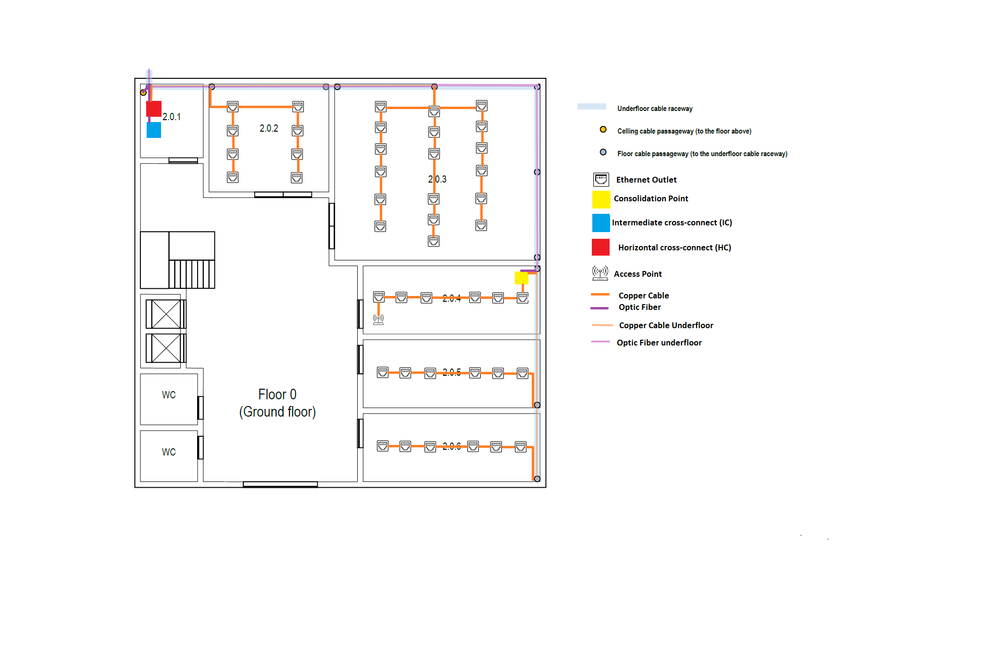
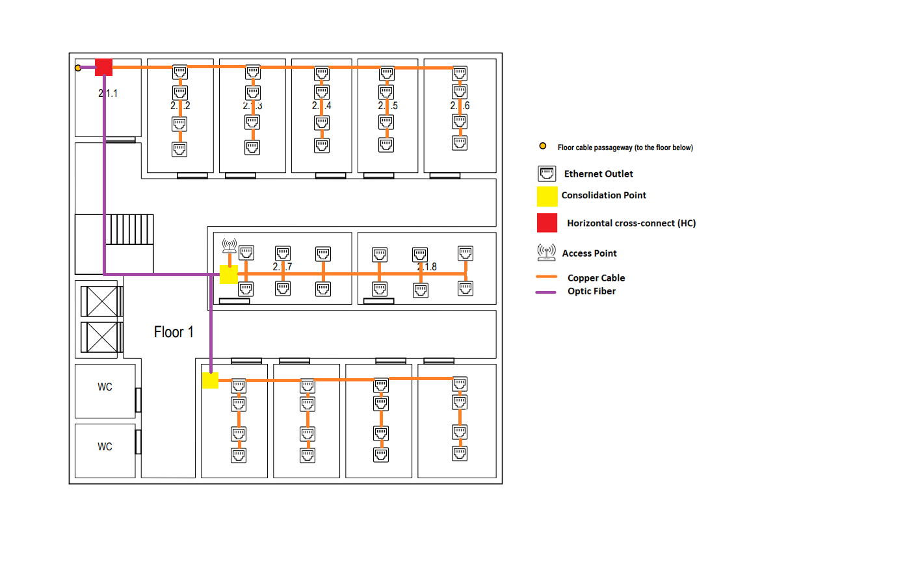

#RCOMP 2021-2022 Project 2DF_04 - Sprint 1 - Member 1200882 

## Building 2
##Floor 0(Ground Floor)

####2.0.1
This room has 8.74m^2 of area, this room is a storage area that may be used to house a cross-connect, no network outlets are required. 

This room has
a Horizontal cross-connect (HC) which provides cable connections to end user outlets at the work area on the floor and its in a
telecommunications enclosures 19'' rack. The HC has patch panel with 48 ports.

The room has an Intermediate cross-connect (IC) which connects to the Main cross-connect (MC) located in building 1. The IC has patch panel with 12 ports.
####2.0.2
This room has 31.62m^2 of area, so in order to satisfy the room, we needed to put 8 outlets.
####2.0.3
This room has 87.50m^2 of area, so in order to satisfy the room, we needed to put 18 outlets.
####2.0.4, 2.0.5 and 2.0.6
This room has 28.15m^2 of area, so in order to satisfy the rooms, we needed to put 6 outlets.

In 2.0.4 room, I choose to place the access-point (it's the most "centered" room of the floor) so it can
cover all the floor with wireless (the access-point has approximately a 50 meters diameter circle coverage). This access point is on channel number 1.

This room also has a consolidation point due to the high outlet density. The consolidation point has a patch panel
with 48 ports in a telecommunications enclosures 19'' rack.
###Equipment used:
In this floor we used cooper cable cat-7 to connect the outlets to the Horizontal cross-connect, to connect the access-point and the
respective outlets to the Consolidation point. We used optic fibre to connect the Intermediate cross-connect (in first floor) to the Horizontal cross-connect of the second floor.

|MATERIAL| QUANTITY | DISTANCE |
|---|----------|----------|
|Cooper cable| 45       | 790m     |
|Optic fibre| 3       | 35m      |
|Ethernet Outlets| 44       | ---      |
|Access point| 1        | ---      |
|Intermidate cross-connect | 1        | ---      |
|Horizontal cross-connect | 1        | ---      |
| Patch panels of 48 ports          |         2         |---        |
| Patch panels of 12 ports          |          1        | ---       |
| Telecommunications' enclosure 19' |          2        | ---       |
|Consolidation point | 1        | ---      |

It will be all mono-mode optical fiber, because this cable can have a higher speed compared to copper cables and higher distance and higher data rates compared to Multimode optical fibre.

The copper cable will be CAT7 because it has a higher frequency than the Cat6 copper cable and more affordable than the optic fibre.
##Floor 1(Upper Floor)

####2.1.1
The rooms have 10.85m^2 of area each, this room is a storage area that may be used to house a cross-connect, no network outlets are required. 

This room has
a Horizontal cross-connect (HC) which provides cable connections to end user outlets at the work area on the floor and its in a
telecommunications enclosures 19'' rack. 
The HC has patch panel with 48 ports.
####2.1.2 and 2.1.3
The room have 16.29m^2 of area , so in order to satisfy the rooms, we needed to put 4 outlets.
####2.1.4 and 2.1.5
The room have 14.85m^2 of area, so in order to satisfy the rooms, we needed to put 4 outlets.
####2.1.6
This room has 18.17m^2 of area, so in order to satisfy the room, we needed to put 4 outlets.
####2.1.7 and 2.1.8
This room has 21.80m^2 of area, so in order to satisfy the rooms, we needed to put 6 outlets.
In 2.1.7 room, I choose to place the access-point (it's the most "centered" room of the floor) so it can
cover all the floor with wireless (the access-point has approximately a 50 meters diameter circle coverage). This access point is on channel number 6.

This room also has a consolidation point due to the high outlet density. The consolidation point has a patch panel
with 48 ports in a telecommunications enclosures 19'' rack.
####2.1.9, 2.1.10 and 2.1.11
This room has 16.29m^2 of area, so in order to satisfy the rooms, we needed to put 4 outlets.
In 2.1.9 room, has a consolidation point due to the high outlet density. The consolidation point has a patch panel
with 48 ports in a telecommunications enclosures 19'' rack.
####2.1.12
This room has 19.14m^2 of area, so in order to satisfy the room, we needed to put 4 outlets.
###Equipment used:
In this floor we used cooper cable cat-7 to connect the outlets to the Horizontal cross-connect, to connect the access-point and the
respective outlets to the Consolidation point. 

|MATERIAL| QUANTITY | DISTANCE |
|---|----------|---------|
|Cooper cable| 49       | 630     |
|Optic fibre| 2        | 34m     |
|Ethernet Outlets| 48       | ---     |
|Access point| 1        | ---     |
|Intermediate cross-connect | 0        | ---     |
|Horizontal cross-connect | 1        | ---     |
| Patch panels of 48 ports          |         3         |  ---     |
| Telecommunications' enclosure 19' |          3        |  ---      |
|Consolidation point | 2        | ---     |
It will be all mono-mode optical fiber, because this cable can have a higher speed compared to copper cables and higher distance and higher data rates compared to Multimode optical fibre.

The copper cable will be CAT7 because it has a higher frequency than the Cat6 copper cable and more affordable than the optic fibre.

##Total inventory:
|MATERIAL| QUANTITY | DISTANCE |
|---|----------|---------|
|Cooper cable| 97       | 1420     |
|Optic fibre| 5        | 69m     |
|Ethernet Outlets| 92       | ---     |
|Access point| 2        | ---     |
|Intermidate cross-connect | 1        | ---     |
|Horizontal cross-connect | 2        | ---     |
| Patch panels of 48 ports          |          5     | ---   |
| Patch panels of 12 ports          |         1         | ---    |
| Telecommunications' enclosure 19' |         5         | ---      |
|Consolidation point | 3        | ---     |