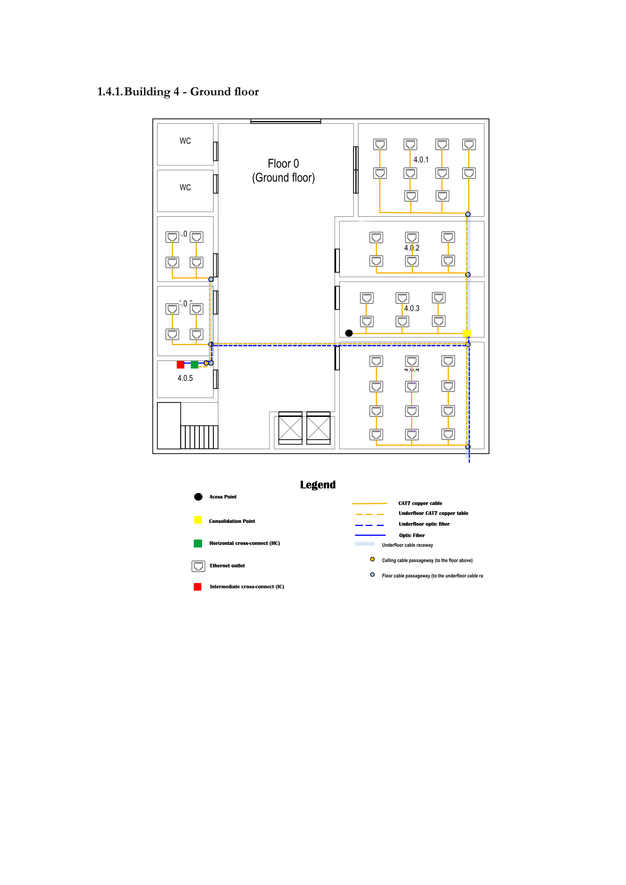
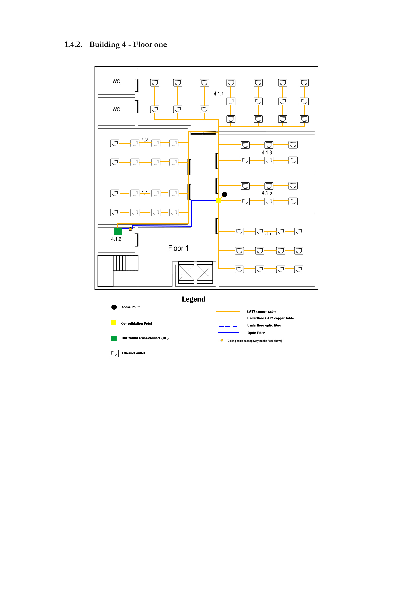

#RCOMP 2021-2022 Project 2DF_04 - Sprint 1 - Member 1201021

## Building 4
##General Description
In the fiber optic cable it will be all mono-mode optical fiber, because this cable can have a higher speed  compared to copper cables and higher distance and higher data rates compared to Multimode optical fibre.  
In the copper cables they will follow the 568A wiring standard.
In the floors we used CAT-7 copper cable because it has a higher frequency than the CAT-6 copper cable, and the equipments for the compatibility are more affordable than the fiber optic ones.  
The Consolidation Points, and the Horizontal Cross-Connects will have some available connections so that in the future the floor wants to have more outlets.
##Floor 0(Ground Floor)

####4.0.1
This room has 40.60m^2 of area, so in order to satisfy the room, we needed to put 10 outlets.
####4.0.2 and 4.0.3
These rooms both have 27.96m^2 of area each, so in order to satisfy the rooms, we needed to put 6 outlets in each room. 
In this room we added an access point because it was the most central room so that it could reach to all the rooms. The access point in this floor is on channel 6.
In room 4.0.3 we have a Consolidation Point as this room is surrounded by a lot of outlets.
The consolidation point has a patch panel with 48 ports in a telecommunications enclosures 19'' rack.
####4.0.4
This room has 53.61m^2 of area, so in order to satisfy the room, we needed to put 12 outlets.
####4.0.5
This room has 6.83m^2 of area.
In this room we placed a Intermediate Cross-Connect and a Horizontal Cross-Connect of the floor.
The Intermediate cross-connect has patch panel with 48 ports.
####4.0.6
This room has 13.08m^2 of area, so in order to satisfy the room, we needed to put 4 outlets.
####4.0.7
The room have 12.49m^2 of area , so in order to satisfy the rooms, we needed to put 4 outlets.
###Equipment used:
We opted to use optic fibre to connect the Intermediate cross-connect, Horizontal cross-connect and the Main cross-connect. In this floor we chose CAT7 copper cables to connect outlets to the  Horizontal cross-connect, to connect the access-point and the
the other outlets to the Consolidation point. 

|MATERIAL|QUANTITY|DISTANCE|
|---|---|---|
|Cooper cable | 43 | 370m|
|Optic fibre| 4| 41m|
|Ethernet Outlets| 42 |---|
|Access point|1|---|
|Intermediate cross-connect | 1 |---|
|Horizontal cross-connect | 1 |---|
| Patch panels of 48 ports          |      2            |  ---       |
| Patch panels of 12 ports          |          1        | ---       |
| Telecommunications' enclosure 19' |        2          | ---       |
|Consolidation point | 1 |---|

##Floor 1(First Floor)

####4.1.1
This room has 81.19m^2 of area, so in order to satisfy the room, we needed to put 18 outlets.
####4.1.2
This room has 34.88m^2 of area, so in order to satisfy the room, we needed to put 8 outlets.
####4.1.3 to 4.1.5
Each room has 28.29m^2 of area, so in order to satisfy the rooms, we needed to put 6 outlets each.
In room 4.1.5 we have a Consolidation Point as this room is surrounded by a lot of outlets.
The consolidation point has a patch panel with 48 ports in a telecommunications enclosures 19'' rack.
In room 4.1.5 we added an access point because it was the most central room so that it could reach to all the rooms. The access point in this floor is on channel 1.

####4.1.4
This room has 30.56m^2 of area, so in order to satisfy the room, we needed to put 8 outlets.
####4.1.6
This room has 7.13m^2 of area.
In this room we placed a Intermediate Cross-Connect and a Horizontal Cross-Connect of the floor.
The Intermediate cross-connect has patch panel with 48 ports.
####4.1.7
This room has 55.01m^2 of area, so in order to satisfy the room, we needed to put 12 outlets.
###Equipment used:
We opted to use optic fibre to connect the Intermediate cross-connect, Horizontal cross-connect and the Main cross-connect. In this floor we chose CAT7 copper cables to connect outlets to the  Horizontal cross-connect, to connect the access-point and the
the other outlets to the Consolidation point.

|MATERIAL|QUANTITY|DISTANCE|
|---|---|---|
|Cooper cable | 59 | 724.25m|
|Optic fibre| 1| 11.69m|
|Ethernet Outlets| 58 |---|
|Access point|1|---|
|Horizontal cross-connect | 1 |---|
| Patch panels of 48 ports          |         2      | ---        |
| Telecommunications' enclosure 19' |           2       | ---       |
|Consolidation point | 1 |---|

##Total inventory:

|MATERIAL|QUANTITY|DISTANCE|
|---|---|---|
|Cooper cable| 101 |1094,25m|
|Optic fibre| 5 | 52,69m|
|Ethernet Outlets| 100 |---|
|Access point|2|---|
|Intermediate cross-connect | 1 |---|
|Horizontal cross-connect | 2 |---|
| Patch panels of 48 ports          |      4           |  ---     |
| Patch panels of 12 ports          |       1           | ---       |
| Telecommunications' enclosure 19' |          4        | ---       |
|Consolidation point | 2 |---|