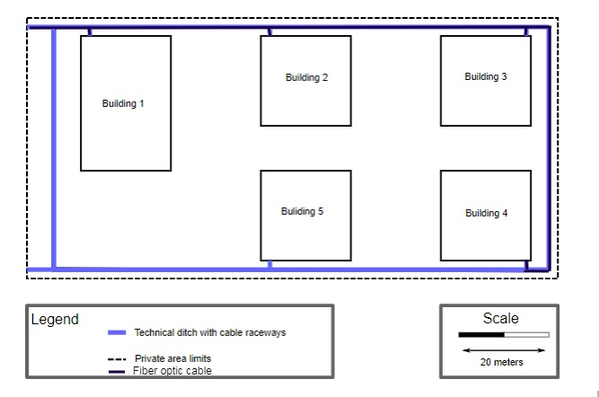
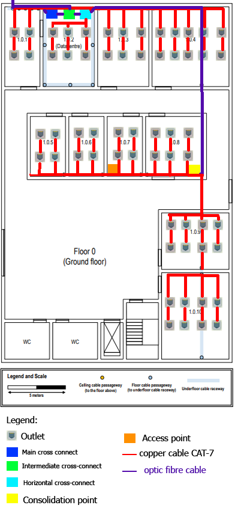
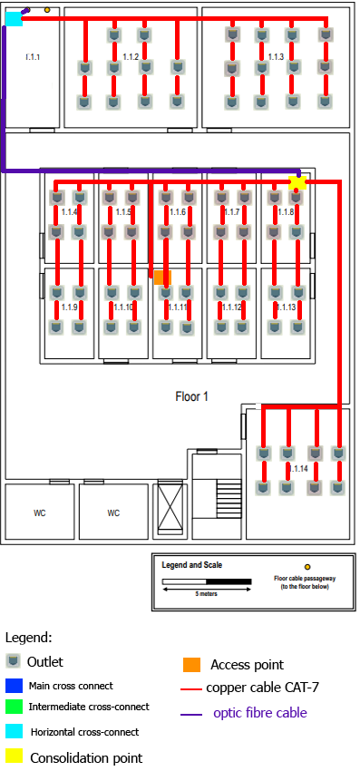

#RCOMP 2021-2022 Project 2DF_04 - Sprint 1 - Member 1201549

## Building 1
##General Description
In the fiber optic cable it will be all mono-mode optical fiber, because this cable can have a higher speed  compared to copper cables and higher distance and higher data rates compared to Multimode optical fibre.  
In the copper cables they will follow the 568A wiring standard.
In the floors we used CAT-7 copper cable because it has a higher frequency than the CAT-6 copper cable, and the equipments for the compatibility are more affordable than the fiber optic ones.  
The Consolidation Points, and the Horizontal Cross-Connects will have some available connections so that in the future the floor wants to have more outlets.
## Campus

| Connections           | Fiber optic Cable distance | 
|-----------------------|----------------------------|
| Initial-Building 1    | 16.7m                      |
| Building 1-Building 2 | 40.84 m                    |  
| Building 1-Building 3 | 96.12 m                    | 
| Building 1-Building 4 | 160.01 m                   |  
| Building 2-Building 3 | 58.62 m                    | 
| Building 2-Building 4 | 122.51 m                   | 
| Building 3-Building 4 | 67.23 m                    |
    Total:  562.03 m with 7 cables
##General Description
The campus requires 562.03 m of optic fibre cable.
In addition to the connections from building 1 to all other buildings (2,3 and 4), there will also be a connection from building 2 to 3, from 2 to 4, from 3 to 4 and because in case there is damage in one of the links the other connections will compensate the lost one.
##Inventory:
| Materials         | Distance(meters) | Quantity |
|-------------------|------------------|----------|
| Optic fibre cable | 562.03           | 7        |

##Floor 0(Ground Floor)  

##General Description  

  

###General Description
####1.0.1
This room has 19.7 m^2 of area, so in order to satisfy the room, we needed to put 4 outlets.
####1.0.2
This room has 28.1 m^2 of area, so in order to satisfy the room, we needed to put 6 outlets.
Has this was called as the Datacentre we placed a Main cross connect with a patch panel of 12 ports,a telecommunications' enclosure 19' format , an Intermediate Cross-Connect for the building with 1 patch panel of 12 ports and a Horizontal Cross-Connect for the floor with 1 patch panel of 48 ports in order to make all connections.
####1.0.3
This room has 28.1 m^2 of area, so in order to satisfy the room, we needed to put 6 outlets.
####1.0.4
This room has 41.99 m^2 of area, so in order to satisfy the room, we needed to put 6 outlets.
####1.0.5 and 1.0.6
The rooms have 14.41 m^2 of area each, so in order to satisfy the rooms, we needed to put 4 outlets in each room.
####1.0.7
The room have 14.41 m^2 of area , so in order to satisfy the rooms, we needed to put 4 outlets.In this room we added an access point with the channel 1 because it was the most central room so that it creates a wireless local area network in the area, and it could reach all the rooms with no concerns.
####1.0.8
The room have 23.91 m^2 of area, so in order to satisfy the room, we needed to put 6 outlets.In this room we added a Consolidation point with 1 patch panels  of 48 ports in a telecommunications' enclosure 19' because of the high ammount of outlets in the area.
####1.0.9
This room has 35.53 m^2 of area, so in order to satisfy the room, we needed to put 8 outlets.
####1.0.10
This room has 39.14 m^2 of area, so in order to satisfy the room, we needed to put 8 outlets.
###Equipment used:
In this floor we used CAT-7 copper cable because it has a higher frequency than the CAT-6 copper cable.  
We used fiber optic to connect the Horizontal Cross-connect,with the Main cross-connect and the Intermediate cross-connect and the Main cross-connect with the Intermediate cross-connect.  
The Consolidation Point, the Horizontal Cross-Connect will have some available connections so that in the future the floor wants to have more outlets.
##Inventory of Floor 0
| Materials                         | Distance(meters) | Quantity |
|-----------------------------------|------------------|----------|
| Outlets                           |                  | 60       |
| Optic Fibre cable                 | 23.85 m          | 5        |
| Copper cable CAT-7                | 359.35 m         | 60       |
| Horizontal cross-connect          |                  | 1        |
| Intermediate cross-connect        |                  | 1        |
| Main cross-connect                |                  | 1        |
| Consolidation point               |                  | 1        |
| Access point                      |                  | 1        |
| Patch panels of 48 ports          |                  | 2        |
| Patch panels of 12 ports          |                  | 2        |
| Telecommunications' enclosure 19' |                  | 2        |

##Floor 1(Ground Floor)

####1.1.1
This room has 18.97 m^2 of area, so in order to satisfy the room, we needed to put 4 outlets.In this room we added a Horizontal cross-connect with 1 patch panel of 48 ports in a  telecommunications' enclosure 19' in order to reach all the outlets.
####1.1.2
This room has 47.11 m^2 of area, so in order to satisfy the room, we needed to put 10 outlets.
####1.1.3
This room has 52.24 m^2 of area, so in order to satisfy the room, we needed to put 12 outlets.
####1.1.4 to 1.1.13
Each room has 13.1 m^2 of area, so in order to satisfy the rooms, we needed to put 4 outlets each.We added in the 1.1.8 room a consolidation point with 2 patch panels of 48 ports in a  telecommunications' enclosure 19' because of the high amount of outlets in the area.Also was added the access point with the channel 6 in the room 1.1.11 so that it creates a wireless local area network in the area, and it doesn't interfere with the floor 0.
####1.1.14
This room has 39.94 m^2 of area, so in order to satisfy the room, we needed to put 8 outlets.
###Equipment used:

##Inventory of Floor 1
| Materials                         | Distance(meters) | Quantity |
|-----------------------------------|------------------|----------|
| Outlets                           |                  | 70       |
| Optic Fibre cable                 | 49,37            | 1        |
| Copper cable CAT-7                | 932.33           | 71       |
| Horizontal cross-connect          |                  | 1        |
| Access point                      |                  | 1        |
| Consolidation point               |                  | 1        |
| Patch panels of 48 ports          |                  | 3        |
| Telecommunications' enclosure 19' |                  | 2        |

##Total inventory:
| Materials                         | Distance(meters) | Quantity |
|-----------------------------------|------------------|----------|
| Outlets                           |                  | 130      |
| Optic Fibre cable                 | 635.25           | 13       |
| Copper cable CAT-7                | 1291.68          | 131      |
| Horizontal cross-connect          |                  | 2        |
| Intermediate cross-connect        |                  | 1        |
| Main cross-connect                |                  | 1        |
| Access point                      |                  | 2        |
| Consolidation point               |                  | 2        |
| Patch panels of 48 ports          |                  | 5        |
| Patch panels of 12 ports          |                  | 2        |
| Telecommunications' enclosure 19' |                  | 4        |
