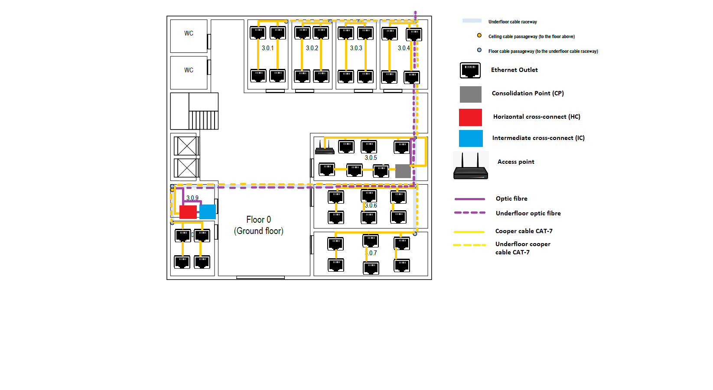
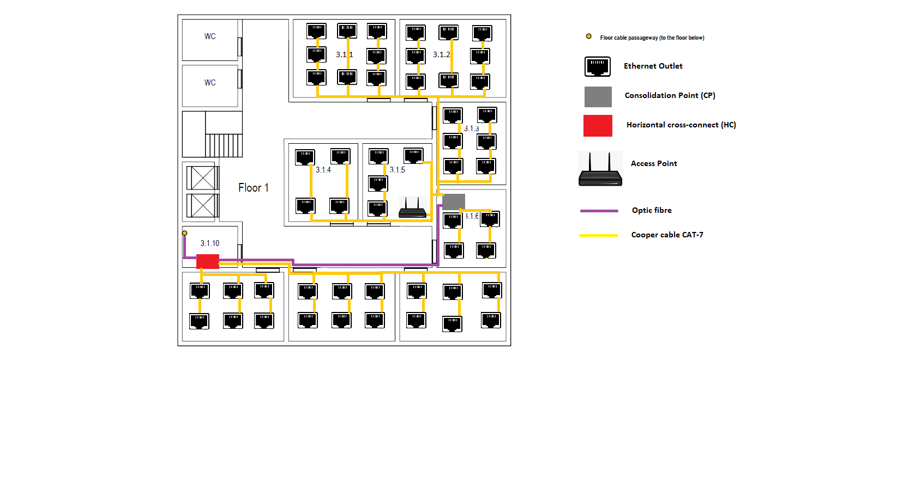

#RCOMP 2021-2022 Project 2DF_04 - Sprint 1 - Member 1201550

## Building 3

##Floor 0(Ground Floor)
  

####3.0.1, 3.0.2 and 3.0.3  
This 3 rooms have all the same area, 16.10m^2, so each room needs 4 outlets.  

####3.0.4  
This room have a area of 18.99m^2, so the room needs 4 outlets.  

####3.0.5, 3.0.6 and 3.0.7  
This 3 rooms have all the same area, 28.59m^2, so each room needs 4 outlets.  

In the room 3.0.5, we choose to place the access-point (it's the most "centered" room of the floor) in order to
cover all the floor with wireless (the access-point has approximately a 50 meters diameter circle coverage). The access point in this floor is on channel 1.

This room also has a consolidation point due to the high outlet density. The consolidation point has a patch panel
with 48 ports in a telecommunications enclosures 19'' rack.  

####3.0.8  
This room have a area of 13.82m^2, so the room needs 4 outlets.  

####3.0.9  
This room is a storage area that may be used to house a cross-connect, no network outlets are required. 

This room has a Horizontal cross-connect (HC) which provides cable connections to end user outlets at the work area on the floor and its in a 
telecommunications enclosures 19'' rack. The Horizontal cross-connect has patch panel with 48 ports.

The room has an Intermediate cross-connect (IC) which connects to the Main cross-connect (MC) located in Building 1. The Intermediate cross-connect has patch panel with 12 ports.
  
###Equipment used:  
It will be all mono-mode optical fiber, because this cable can have a higher speed compared to copper cables and higher distance and higher data rates compared to Multimode optical fibre.

The copper cable will be CAT7 because it has a higher frequency than the Cat6 copper cable and more affordable than the optic fibre.

|MATERIAL|QUANTITY|DISTANCE|
|---|---|---|
|Cooper cable | 39 | 490m|
|Optic fibre| 4| 60m|
|Ethernet Outlets| 38 |---|
|Access point|1|---|
|Intermediate cross-connect | 1 |---|
|Horizontal cross-connect | 1 |---|
|Consolidation point | 1 |---|
| Patch panels of 48 ports          |                  | 2        |
| Patch panels of 12 ports          |                  | 1        |
| Telecommunications' enclosure 19' |                  | 2        |

##Floor 1(First Floor)

####3.1.1  
This room have a area of 31.96m^2, so the room needs 8 outlets.  
####3.1.2  
This room have a area of 33.42m^2, so the room needs 8 outlets.  
####3.1.3  
This room have a area of 20.77m^2, so the room needs 6 outlets.  

####3.1.4, 3.1.5 and 3.1.6  
This 3 rooms have all the same area, 19.60m^2, so each room needs 4 outlets.

In the room 3.1.5 we placed the access-point (same justification of the previous floor) in order to cover all the floor with wireless. The access point in this floor is on channel 6.

The 3.1.6 has a consolidation point due to the high outlet density. The consolidation point has a patch panel
with 48 ports in a telecommunications enclosures 19'' rack.
  
####3.1.7 and 3.1.8   
This 2 rooms have all the same area, 26.52m^2, so each room needs 6 outlets.  
####3.1.9  
This room have a area of 25.36m^2, so the room needs 6 outlets.  
####3.1.10
This room is a storage area that may be used to house a cross-connect, no network outlets are required.

This room has a Horizontal cross-connect (HC) which provides cable connections to end user outlets at the work area on the floor and its in a
telecommunications enclosures 19'' rack. The Horizontal cross-connect has patch panel with 48 ports.  

###Equipment used:  
It will be all mono-mode optical fiber, because this cable can have a higher speed compared to copper cables and higher distance and higher data rates compared to Multimode optical fibre.

The copper cable will be CAT7 because it has a higher frequency than the Cat6 copper cable and more affordable than the optic fibre.

|MATERIAL|QUANTITY|DISTANCE|
|---|---|---|
|Cooper cable|53|510m|
|Optic fibre| 1| 20m|
|Ethernet Outlets|52|---|
|Access point|1|---|
|Horizontal cross-connect | 1 |---|
|Consolidation point | 1 |---|
| Patch panels of 48 ports          |                  | 1       |
| Telecommunications' enclosure 19' |                  | 2       |
  
##Total inventory:  

|MATERIAL|QUANTITY|DISTANCE|
|---|---|---|
|Cooper cable|92|1000m|
|Optic fibre| 5| 80m|
|Ethernet Outlets|90|---|
|Access point|2|---|
|Intermediate cross-connect | 1 |---|
|Horizontal cross-connect | 2 |---|
|Consolidation point | 2 |---|
| Patch panels of 48 ports          |                  | 3        |
| Patch panels of 12 ports          |                  | 1        |
| Telecommunications' enclosure 19' |                  | 4        |
