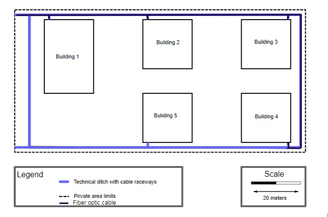
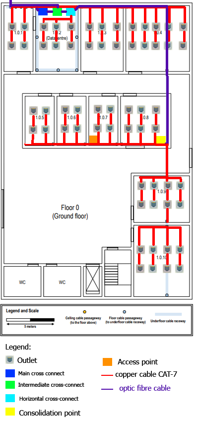
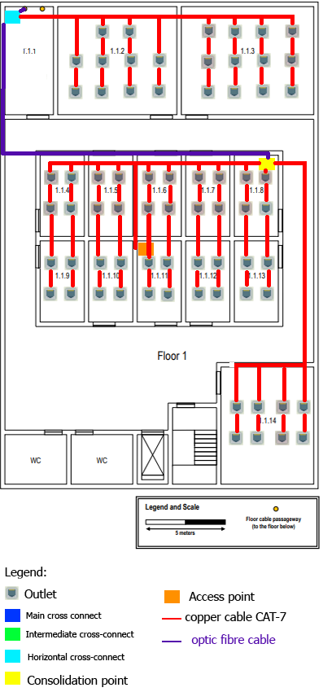
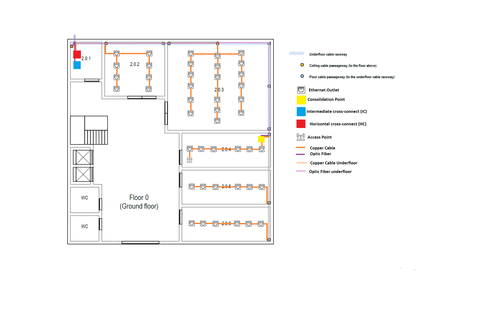
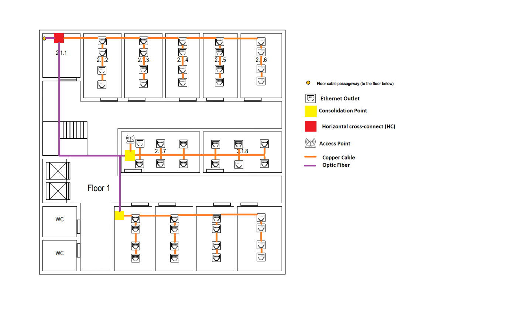
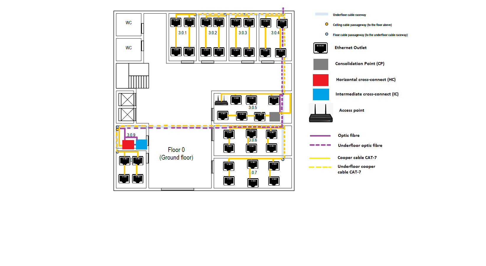
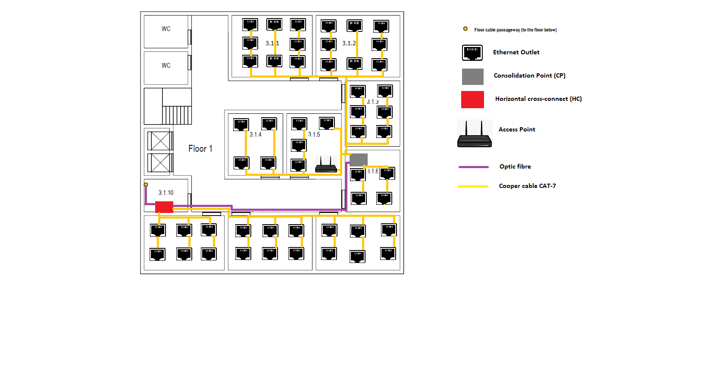
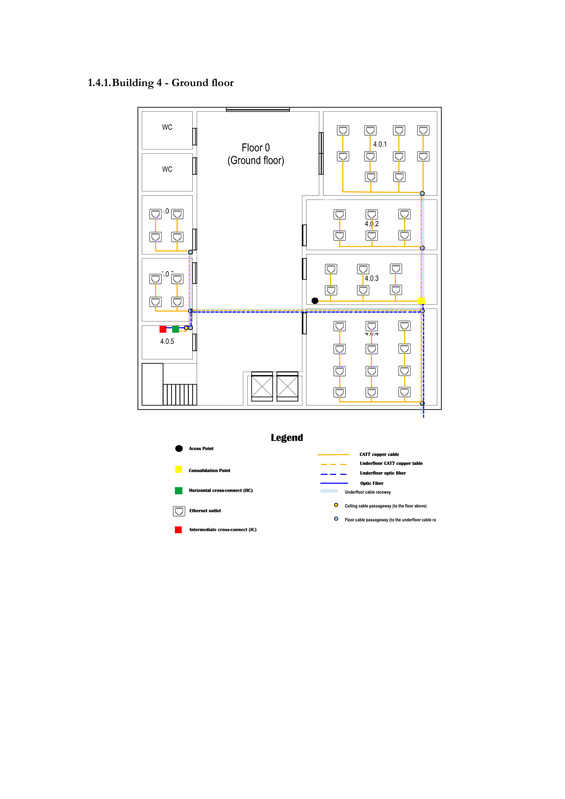
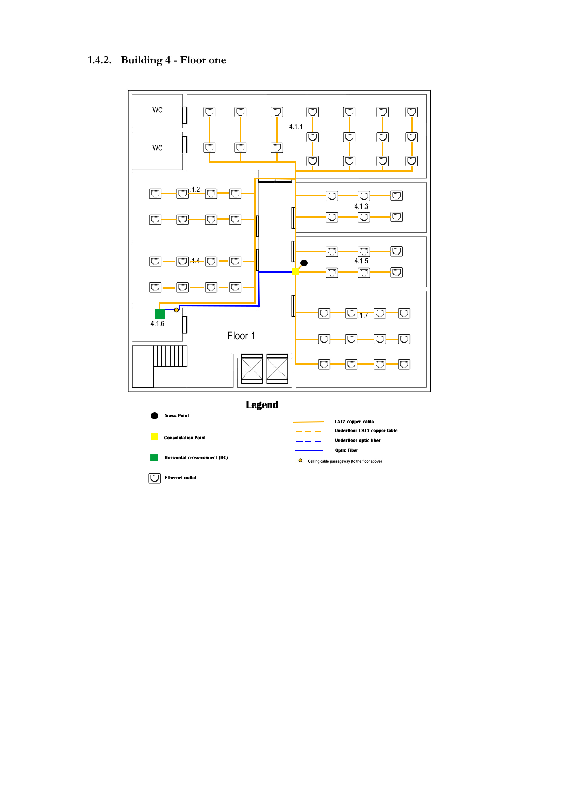

#RCOMP 2021-2022 Project 2DF_04 - Sprint 1 - Member 1201549

## Building 1
##General Description
In the fiber optic cable it will be all mono-mode optical fiber, because this cable can have a higher speed  compared to copper cables and higher distance and higher data rates compared to Multimode optical fibre.  
In the copper cables they will follow the 568A wiring standard.
In the floors we used CAT-7 copper cable because it has a higher frequency than the CAT-6 copper cable, and the equipments for the compatibility are more affordable than the fiber optic ones.  
The Consolidation Points, and the Horizontal Cross-Connects will have some available connections so that in the future the floor wants to have more outlets.
## Campus

| Connections           | Fiber optic Cable distance | 
|-----------------------|----------------------------|
| Initial-Building 1    | 16.7m                      |
| Building 1-Building 2 | 40.84 m                    |  
| Building 1-Building 3 | 96.12 m                    | 
| Building 1-Building 4 | 160.01 m                   |  
| Building 2-Building 3 | 58.62 m                    | 
| Building 2-Building 4 | 122.51 m                   | 
| Building 3-Building 4 | 67.23 m                    |
    Total:  562.03 m with 7 cables
##General Description
The campus requires 562.03 m of optic fibre cable.
In addition to the connections from building 1 to all other buildings (2,3 and 4), there will also be a connection from building 2 to 3, from 2 to 4, from 3 to 4 and because in case there is damage in one of the links the other connections will compensate the lost one.
##Inventory:
| Materials         | Distance(meters) | Quantity |
|-------------------|------------------|----------|
| Optic fibre cable | 562.03           | 7        |

##Floor 0(Ground Floor)

##General Description

###General Description
####1.0.1
This room has 19.7 m^2 of area, so in order to satisfy the room, we needed to put 4 outlets.
####1.0.2
This room has 28.1 m^2 of area, so in order to satisfy the room, we needed to put 6 outlets.
Has this was called as the Datacentre we placed a Main cross connect with a patch panel of 12 ports,a telecommunications' enclosure 19' format , an Intermediate Cross-Connect for the building with 1 patch panel of 12 ports and a Horizontal Cross-Connect for the floor with 1 patch panel of 48 ports in order to make all connections.
####1.0.3
This room has 28.1 m^2 of area, so in order to satisfy the room, we needed to put 6 outlets.
####1.0.4
This room has 41.99 m^2 of area, so in order to satisfy the room, we needed to put 6 outlets.
####1.0.5 and 1.0.6
The rooms have 14.41 m^2 of area each, so in order to satisfy the rooms, we needed to put 4 outlets in each room.
####1.0.7
The room have 14.41 m^2 of area , so in order to satisfy the rooms, we needed to put 4 outlets.In this room we added an access point with the channel 1 because it was the most central room so that it creates a wireless local area network in the area, and it could reach all the rooms with no concerns.
####1.0.8
The room have 23.91 m^2 of area, so in order to satisfy the room, we needed to put 6 outlets.In this room we added a Consolidation point with 1 patch panels  of 48 ports in a telecommunications' enclosure 19' because of the high ammount of outlets in the area.
####1.0.9
This room has 35.53 m^2 of area, so in order to satisfy the room, we needed to put 8 outlets.
####1.0.10
This room has 39.14 m^2 of area, so in order to satisfy the room, we needed to put 8 outlets.
###Equipment used:
In this floor we used CAT-7 copper cable because it has a higher frequency than the CAT-6 copper cable.  
We used fiber optic to connect the Horizontal Cross-connect,with the Main cross-connect and the Intermediate cross-connect and the Main cross-connect with the Intermediate cross-connect.  
The Consolidation Point, the Horizontal Cross-Connect will have some available connections so that in the future the floor wants to have more outlets.
##Inventory of Floor 0
| Materials                         | Distance(meters) | Quantity |
|-----------------------------------|------------------|----------|
| Outlets                           |                  | 60       |
| Optic Fibre cable                 | 23.85 m          | 5        |
| Copper cable CAT-7                | 359.35 m         | 60       |
| Horizontal cross-connect          |                  | 1        |
| Intermediate cross-connect        |                  | 1        |
| Main cross-connect                |                  | 1        |
| Consolidation point               |                  | 1        |
| Access point                      |                  | 1        |
| Patch panels of 48 ports          |                  | 2        |
| Patch panels of 12 ports          |                  | 2        |
| Telecommunications' enclosure 19' |                  | 2        |

##Floor 1(Ground Floor)

####1.1.1
This room has 18.97 m^2 of area, so in order to satisfy the room, we needed to put 4 outlets.In this room we added a Horizontal cross-connect with 1 patch panel of 48 ports in a  telecommunications' enclosure 19' in order to reach all the outlets.
####1.1.2
This room has 47.11 m^2 of area, so in order to satisfy the room, we needed to put 10 outlets.
####1.1.3
This room has 52.24 m^2 of area, so in order to satisfy the room, we needed to put 12 outlets.
####1.1.4 to 1.1.13
Each room has 13.1 m^2 of area, so in order to satisfy the rooms, we needed to put 4 outlets each.We added in the 1.1.8 room a consolidation point with 2 patch panels of 48 ports in a  telecommunications' enclosure 19' because of the high amount of outlets in the area.Also was added the access point with the channel 6 in the room 1.1.11 so that it creates a wireless local area network in the area, and it doesn't interfere with the floor 0.
####1.1.14
This room has 39.94 m^2 of area, so in order to satisfy the room, we needed to put 8 outlets.
###Equipment used:

##Inventory of Floor 1
| Materials                         | Distance(meters) | Quantity |
|-----------------------------------|------------------|----------|
| Outlets                           |                  | 70       |
| Optic Fibre cable                 | 49,37            | 1        |
| Copper cable CAT-7                | 932.33           | 71       |
| Horizontal cross-connect          |                  | 1        |
| Access point                      |                  | 1        |
| Consolidation point               |                  | 1        |
| Patch panels of 48 ports          |                  | 3        |
| Telecommunications' enclosure 19' |                  | 2        |

##Total inventory:
| Materials                         | Distance(meters) | Quantity |
|-----------------------------------|------------------|----------|
| Outlets                           |                  | 130      |
| Optic Fibre cable                 | 635.25           | 13       |
| Copper cable CAT-7                | 1291.68          | 131      |
| Horizontal cross-connect          |                  | 2        |
| Intermediate cross-connect        |                  | 1        |
| Main cross-connect                |                  | 1        |
| Access point                      |                  | 2        |
| Consolidation point               |                  | 2        |
| Patch panels of 48 ports          |                  | 5        |
| Patch panels of 12 ports          |                  | 2        |
| Telecommunications' enclosure 19' |                  | 4        |

#RCOMP 2021-2022 Project 2DF_04 - Sprint 1 - Member 1200882

## Building 2
##Floor 0(Ground Floor)

####2.0.1
This room has 8.74m^2 of area, this room is a storage area that may be used to house a cross-connect, no network outlets are required.

This room has
a Horizontal cross-connect (HC) which provides cable connections to end user outlets at the work area on the floor and its in a
telecommunications enclosures 19'' rack. The HC has patch panel with 48 ports.

The room has an Intermediate cross-connect (IC) which connects to the Main cross-connect (MC) located in building 1. The IC has patch panel with 12 ports.
####2.0.2
This room has 31.62m^2 of area, so in order to satisfy the room, we needed to put 8 outlets.
####2.0.3
This room has 87.50m^2 of area, so in order to satisfy the room, we needed to put 18 outlets.
####2.0.4, 2.0.5 and 2.0.6
This room has 28.15m^2 of area, so in order to satisfy the rooms, we needed to put 6 outlets.

In 2.0.4 room, I choose to place the access-point (it's the most "centered" room of the floor) so it can
cover all the floor with wireless (the access-point has approximately a 50 meters diameter circle coverage). This access point is on channel number 1.

This room also has a consolidation point due to the high outlet density. The consolidation point has a patch panel
with 48 ports in a telecommunications enclosures 19'' rack.
###Equipment used:
In this floor we used cooper cable cat-7 to connect the outlets to the Horizontal cross-connect, to connect the access-point and the
respective outlets to the Consolidation point. We used optic fibre to connect the Intermediate cross-connect (in first floor) to the Horizontal cross-connect of the second floor.

|MATERIAL| QUANTITY | DISTANCE |
|---|----------|----------|
|Cooper cable| 45       | 790m     |
|Optic fibre| 3       | 35m      |
|Ethernet Outlets| 44       | ---      |
|Access point| 1        | ---      |
|Intermidate cross-connect | 1        | ---      |
|Horizontal cross-connect | 1        | ---      |
| Patch panels of 48 ports          |         2         |---        |
| Patch panels of 12 ports          |          1        | ---       |
| Telecommunications' enclosure 19' |          2        | ---       |
|Consolidation point | 1        | ---      |

It will be all mono-mode optical fiber, because this cable can have a higher speed compared to copper cables and higher distance and higher data rates compared to Multimode optical fibre.

The copper cable will be CAT7 because it has a higher frequency than the Cat6 copper cable and more affordable than the optic fibre.
##Floor 1(Upper Floor)

####2.1.1
The rooms have 10.85m^2 of area each, this room is a storage area that may be used to house a cross-connect, no network outlets are required.

This room has
a Horizontal cross-connect (HC) which provides cable connections to end user outlets at the work area on the floor and its in a
telecommunications enclosures 19'' rack.
The HC has patch panel with 48 ports.
####2.1.2 and 2.1.3
The room have 16.29m^2 of area , so in order to satisfy the rooms, we needed to put 4 outlets.
####2.1.4 and 2.1.5
The room have 14.85m^2 of area, so in order to satisfy the rooms, we needed to put 4 outlets.
####2.1.6
This room has 18.17m^2 of area, so in order to satisfy the room, we needed to put 4 outlets.
####2.1.7 and 2.1.8
This room has 21.80m^2 of area, so in order to satisfy the rooms, we needed to put 6 outlets.
In 2.1.7 room, I choose to place the access-point (it's the most "centered" room of the floor) so it can
cover all the floor with wireless (the access-point has approximately a 50 meters diameter circle coverage). This access point is on channel number 6.

This room also has a consolidation point due to the high outlet density. The consolidation point has a patch panel
with 48 ports in a telecommunications enclosures 19'' rack.
####2.1.9, 2.1.10 and 2.1.11
This room has 16.29m^2 of area, so in order to satisfy the rooms, we needed to put 4 outlets.
In 2.1.9 room, has a consolidation point due to the high outlet density. The consolidation point has a patch panel
with 48 ports in a telecommunications enclosures 19'' rack.
####2.1.12
This room has 19.14m^2 of area, so in order to satisfy the room, we needed to put 4 outlets.
###Equipment used:
In this floor we used cooper cable cat-7 to connect the outlets to the Horizontal cross-connect, to connect the access-point and the
respective outlets to the Consolidation point.

|MATERIAL| QUANTITY | DISTANCE |
|---|----------|---------|
|Cooper cable| 49       | 630     |
|Optic fibre| 2        | 34m     |
|Ethernet Outlets| 48       | ---     |
|Access point| 1        | ---     |
|Intermediate cross-connect | 0        | ---     |
|Horizontal cross-connect | 1        | ---     |
| Patch panels of 48 ports          |         3         |  ---     |
| Telecommunications' enclosure 19' |          3        |  ---      |
|Consolidation point | 2        | ---     |
It will be all mono-mode optical fiber, because this cable can have a higher speed compared to copper cables and higher distance and higher data rates compared to Multimode optical fibre.

The copper cable will be CAT7 because it has a higher frequency than the Cat6 copper cable and more affordable than the optic fibre.

##Total inventory:
|MATERIAL| QUANTITY | DISTANCE |
|---|----------|---------|
|Cooper cable| 97       | 1420     |
|Optic fibre| 5        | 69m     |
|Ethernet Outlets| 92       | ---     |
|Access point| 2        | ---     |
|Intermidate cross-connect | 1        | ---     |
|Horizontal cross-connect | 2        | ---     |
| Patch panels of 48 ports          |          5     | ---   |
| Patch panels of 12 ports          |         1         | ---    |
| Telecommunications' enclosure 19' |         5         | ---      |
|Consolidation point | 3        | ---     |

#RCOMP 2021-2022 Project 2DF_04 - Sprint 1 - Member 1201550

## Building 3

##Floor 0(Ground Floor)

####3.0.1, 3.0.2 and 3.0.3
This 3 rooms have all the same area, 16.10m^2, so each room needs 4 outlets.

####3.0.4
This room have a area of 18.99m^2, so the room needs 4 outlets.

####3.0.5, 3.0.6 and 3.0.7
This 3 rooms have all the same area, 28.59m^2, so each room needs 4 outlets.

In the room 3.0.5, we choose to place the access-point (it's the most "centered" room of the floor) in order to
cover all the floor with wireless (the access-point has approximately a 50 meters diameter circle coverage). The access point in this floor is on channel 1.

This room also has a consolidation point due to the high outlet density. The consolidation point has a patch panel
with 48 ports in a telecommunications enclosures 19'' rack.

####3.0.8
This room have a area of 13.82m^2, so the room needs 4 outlets.

####3.0.9
This room is a storage area that may be used to house a cross-connect, no network outlets are required.

This room has a Horizontal cross-connect (HC) which provides cable connections to end user outlets at the work area on the floor and its in a
telecommunications enclosures 19'' rack. The Horizontal cross-connect has patch panel with 48 ports.

The room has an Intermediate cross-connect (IC) which connects to the Main cross-connect (MC) located in Building 1. The Intermediate cross-connect has patch panel with 12 ports.

###Equipment used:
It will be all mono-mode optical fiber, because this cable can have a higher speed compared to copper cables and higher distance and higher data rates compared to Multimode optical fibre.

The copper cable will be CAT7 because it has a higher frequency than the Cat6 copper cable and more affordable than the optic fibre.

|MATERIAL|QUANTITY|DISTANCE|
|---|---|---|
|Cooper cable | 39 | 490m|
|Optic fibre| 4| 60m|
|Ethernet Outlets| 38 |---|
|Access point|1|---|
|Intermediate cross-connect | 1 |---|
|Horizontal cross-connect | 1 |---|
|Consolidation point | 1 |---|
| Patch panels of 48 ports          |                  | 2        |
| Patch panels of 12 ports          |                  | 1        |
| Telecommunications' enclosure 19' |                  | 2        |

##Floor 1(First Floor)

####3.1.1
This room have a area of 31.96m^2, so the room needs 8 outlets.
####3.1.2
This room have a area of 33.42m^2, so the room needs 8 outlets.
####3.1.3
This room have a area of 20.77m^2, so the room needs 6 outlets.

####3.1.4, 3.1.5 and 3.1.6
This 3 rooms have all the same area, 19.60m^2, so each room needs 4 outlets.

In the room 3.1.5 we placed the access-point (same justification of the previous floor) in order to cover all the floor with wireless. The access point in this floor is on channel 6.

The 3.1.6 has a consolidation point due to the high outlet density. The consolidation point has a patch panel
with 48 ports in a telecommunications enclosures 19'' rack.

####3.1.7 and 3.1.8
This 2 rooms have all the same area, 26.52m^2, so each room needs 6 outlets.
####3.1.9
This room have a area of 25.36m^2, so the room needs 6 outlets.
####3.1.10
This room is a storage area that may be used to house a cross-connect, no network outlets are required.

This room has a Horizontal cross-connect (HC) which provides cable connections to end user outlets at the work area on the floor and its in a
telecommunications enclosures 19'' rack. The Horizontal cross-connect has patch panel with 48 ports.

###Equipment used:
It will be all mono-mode optical fiber, because this cable can have a higher speed compared to copper cables and higher distance and higher data rates compared to Multimode optical fibre.

The copper cable will be CAT7 because it has a higher frequency than the Cat6 copper cable and more affordable than the optic fibre.

|MATERIAL|QUANTITY|DISTANCE|
|---|---|---|
|Cooper cable|53|510m|
|Optic fibre| 1| 20m|
|Ethernet Outlets|52|---|
|Access point|1|---|
|Horizontal cross-connect | 1 |---|
|Consolidation point | 1 |---|
| Patch panels of 48 ports          |                  | 1       |
| Telecommunications' enclosure 19' |                  | 2       |

##Total inventory:

|MATERIAL|QUANTITY|DISTANCE|
|---|---|---|
|Cooper cable|92|1000m|
|Optic fibre| 5| 80m|
|Ethernet Outlets|90|---|
|Access point|2|---|
|Intermediate cross-connect | 1 |---|
|Horizontal cross-connect | 2 |---|
|Consolidation point | 2 |---|
| Patch panels of 48 ports          |                  | 3        |
| Patch panels of 12 ports          |                  | 1        |
| Telecommunications' enclosure 19' |                  | 4        |

#RCOMP 2021-2022 Project 2DF_04 - Sprint 1 - Member 1201021

## Building 4
##General Description
In the fiber optic cable it will be all mono-mode optical fiber, because this cable can have a higher speed  compared to copper cables and higher distance and higher data rates compared to Multimode optical fibre.  
In the copper cables they will follow the 568A wiring standard.
In the floors we used CAT-7 copper cable because it has a higher frequency than the CAT-6 copper cable, and the equipments for the compatibility are more affordable than the fiber optic ones.  
The Consolidation Points, and the Horizontal Cross-Connects will have some available connections so that in the future the floor wants to have more outlets.
##Floor 0(Ground Floor)

####4.0.1
This room has 40.60m^2 of area, so in order to satisfy the room, we needed to put 10 outlets.
####4.0.2 and 4.0.3
These rooms both have 27.96m^2 of area each, so in order to satisfy the rooms, we needed to put 6 outlets in each room.
In this room we added an access point because it was the most central room so that it could reach to all the rooms. The access point in this floor is on channel 6.
In room 4.0.3 we have a Consolidation Point as this room is surrounded by a lot of outlets.
The consolidation point has a patch panel with 48 ports in a telecommunications enclosures 19'' rack.
####4.0.4
This room has 53.61m^2 of area, so in order to satisfy the room, we needed to put 12 outlets.
####4.0.5
This room has 6.83m^2 of area.
In this room we placed a Intermediate Cross-Connect and a Horizontal Cross-Connect of the floor.
The Intermediate cross-connect has patch panel with 48 ports.
####4.0.6
This room has 13.08m^2 of area, so in order to satisfy the room, we needed to put 4 outlets.
####4.0.7
The room have 12.49m^2 of area , so in order to satisfy the rooms, we needed to put 4 outlets.
###Equipment used:
We opted to use optic fibre to connect the Intermediate cross-connect, Horizontal cross-connect and the Main cross-connect. In this floor we chose CAT7 copper cables to connect outlets to the  Horizontal cross-connect, to connect the access-point and the
the other outlets to the Consolidation point.

|MATERIAL|QUANTITY|DISTANCE|
|---|---|---|
|Cooper cable | 43 | 370m|
|Optic fibre| 4| 41m|
|Ethernet Outlets| 42 |---|
|Access point|1|---|
|Intermediate cross-connect | 1 |---|
|Horizontal cross-connect | 1 |---|
| Patch panels of 48 ports          |      2            |  ---       |
| Patch panels of 12 ports          |          1        | ---       |
| Telecommunications' enclosure 19' |        2          | ---       |
|Consolidation point | 1 |---|

##Floor 1(First Floor)

####4.1.1
This room has 81.19m^2 of area, so in order to satisfy the room, we needed to put 18 outlets.
####4.1.2
This room has 34.88m^2 of area, so in order to satisfy the room, we needed to put 8 outlets.
####4.1.3 to 4.1.5
Each room has 28.29m^2 of area, so in order to satisfy the rooms, we needed to put 6 outlets each.
In room 4.1.5 we have a Consolidation Point as this room is surrounded by a lot of outlets.
The consolidation point has a patch panel with 48 ports in a telecommunications enclosures 19'' rack.
In room 4.1.5 we added an access point because it was the most central room so that it could reach to all the rooms. The access point in this floor is on channel 1.

####4.1.4
This room has 30.56m^2 of area, so in order to satisfy the room, we needed to put 8 outlets.
####4.1.6
This room has 7.13m^2 of area.
In this room we placed a Intermediate Cross-Connect and a Horizontal Cross-Connect of the floor.
The Intermediate cross-connect has patch panel with 48 ports.
####4.1.7
This room has 55.01m^2 of area, so in order to satisfy the room, we needed to put 12 outlets.
###Equipment used:
We opted to use optic fibre to connect the Intermediate cross-connect, Horizontal cross-connect and the Main cross-connect. In this floor we chose CAT7 copper cables to connect outlets to the  Horizontal cross-connect, to connect the access-point and the
the other outlets to the Consolidation point.

|MATERIAL|QUANTITY|DISTANCE|
|---|---|---|
|Cooper cable | 59 | 724.25m|
|Optic fibre| 1| 11.69m|
|Ethernet Outlets| 58 |---|
|Access point|1|---|
|Horizontal cross-connect | 1 |---|
| Patch panels of 48 ports          |         2      | ---        |
| Telecommunications' enclosure 19' |           2       | ---       |
|Consolidation point | 1 |---|

##Total inventory:

|MATERIAL|QUANTITY|DISTANCE|
|---|---|---|
|Cooper cable| 101 |1094,25m|
|Optic fibre| 5 | 52,69m|
|Ethernet Outlets| 100 |---|
|Access point|2|---|
|Intermediate cross-connect | 1 |---|
|Horizontal cross-connect | 2 |---|
| Patch panels of 48 ports          |      4           |  ---     |
| Patch panels of 12 ports          |       1           | ---       |
| Telecommunications' enclosure 19' |          4        | ---       |
|Consolidation point | 2 |---|

##Conclusion of All buildings

##Total inventory:
| Materials                         | Distance(meters) | Quantity |
|-----------------------------------|------------------|----------|
| Outlets                           |                  | 412      |
| Optic Fibre cable                 | 836.94           | 28       |
| Copper cable CAT-7                | 4,805.93         | 329      |
| Horizontal cross-connect          |                  | 8        |
| Intermediate cross-connect        |                  | 4        |
| Main cross-connect                |                  | 1        |
| Access point                      |                  | 8        |
| Consolidation point               |                  | 9        |
| Patch panels of 48 ports          |                  | 19       |
| Patch panels of 12 ports          |                  | 5        |
| Telecommunications' enclosure 19' |                  | 17       |