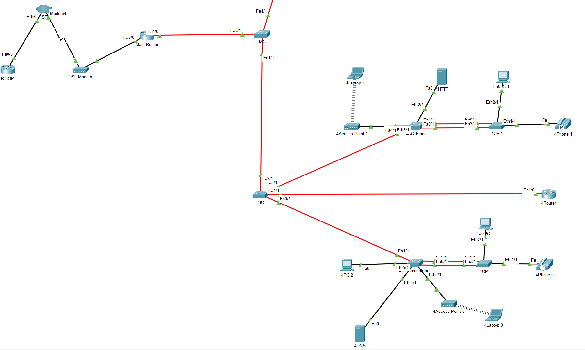
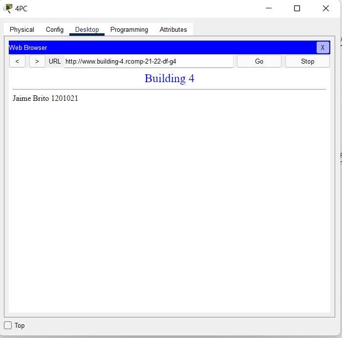
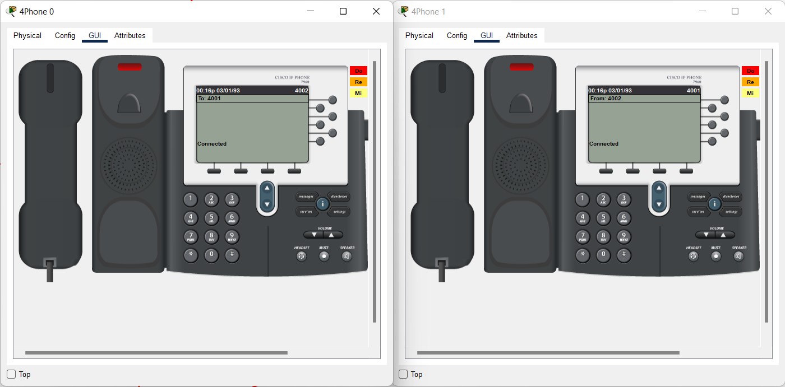
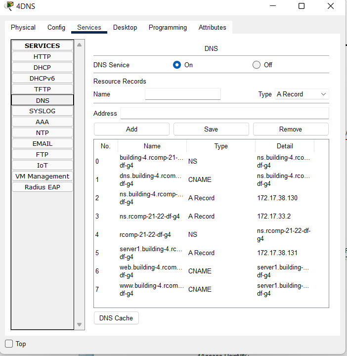

RCOMP 2021-2022 Project - Sprint 4 - Member 1201021
===========================================
### Jaime Brito

-------------------------------------------------------------------

### Building 4

-------------------------------------------------------------------

-------------------------------------------------------------------

### IP Subnetting
Os seguintes ips foram atribuidos a cada VLAN.

-------------------------------------------------------------------

| Rede          | Nodes | Item       | VLAN      |MASK|
|---------------|-------|------------|-----------|-----|
| 172.17.38.161 | 28    | GroundFloor  | 296       | 255.255.255.224    |
| 172.17.38.193   | 55   | First Floor        | 297       |255.255.255.192     |
| 172.17.38.1 | 70   | WIFI       | 298       |255.255.255.128     |
| 172.17.38.129   | 10    | DMZ | 299       |255.255.255.240     |
| 172.17.38.145  | 12    | VoIP       | 300       |255.255.255.240     |

-------------------------------------------------------------------

## Configurations & Commands

#### OSPF (Open Shortest Path First)

- A configuração do OSPF é:
	- **Router(config)#** router ospf 4
	- **Router(config)#** network 172.17.32.0 0.0.0.127 area 0
	- **Router(config)#** network 172.17.38.0 0.0.1.255 area 4

-------------------------------------------------------------------

#### HTTP Server

- Um servidor foi adicionado à DMZ.
- O HTML criado é este: 

-------------------------------------------------------------------

#### DHCPv4 Service

- DHCP  foi adicionado a todos os local networks a cada VLAN.
* Floor 0:
	- **Router(config)#** ip dhcp pool 4Ground
	- **Router(config)#** network 172.17.38.160 255.255.255.224
	- **Router(config)#** default-router 172.17.38.161
	- **Router(config)#** dns-server 172.17.38.130
	- **Router(config)#** domain-name building-4.rcomp-21-22-df-g4
* Floor 1:
	- **Router(config)#** ip dhcp pool 4First
    - **Router(config)#** network 172.17.38.192 255.255.255.192
    - **Router(config)#** default-router 172.17.38.193
    - **Router(config)#** dns-server 172.17.38.130
    - **Router(config)#** domain-name building-4.rcomp-21-22-df-g4
* WiFi:
	- **Router(config)#** ip dhcp pool 4Wifi
    - **Router(config)#** network 172.17.38.0 255.255.255.128
    - **Router(config)#** default-router 172.17.38.1
    - **Router(config)#** dns-server 172.17.38.130
    - **Router(config)#** domain-name building-4.rcomp-21-22-df-g4
* VoIP:
	- **Router(config)#** ip dhcp pool 4VoIP
	- **Router(config)#** network 172.17.38.144 255.255.255.240
	- **Router(config)#** default-router 172.17.38.145
	- **Router(config)#** option 150 ip 172.17.38.145
	- **Router(config)#** dns-server 172.17.38.130
	- **Router(config)#** domain-name building-4.rcomp-21-22-df-g4

-------------------------------------------------------------------

* Foi garantido que os gateway adresses foram excluidos da pool:
	- **Router(config)#** ip dhcp excluded-address 10.124.231.129
	- **Router(config)#** ip dhcp excluded-address 10.124.231.65
	- **Router(config)#** ip dhcp excluded-address 10.124.231.1
	- **Router(config)#** ip dhcp excluded-address 10.124.231.193
	- **Router(config)#** ip dhcp excluded-address 10.124.230.1

-------------------------------------------------------------------

#### VoIP Service

- Os VoIP phones foram adicionados à network e podem comunicar um com o outro,todos os comandos encontram-se em baixo:
    - **Router(config)#** telephony-service
    - **Router(config)#** max-ephones 20
    - **Router(config)#** max-dn 20
    - **Router(config-telephony)#** ip source-address 172.17.38.145 port 4000
    - **Router(config-telephony)#** exit
    - **Router(config)#** ephone-dn 11
    - **Router(config-ephone-dn)#** number 4001
    - **Router(config-ephone-dn)#** exit
    - **Router(config)#** ephone-dn 12
    - **Router(config-ephone-dn)#** number 4002
    - **Router(config-ephone-dn)#** exit
    - **Router(config)#** ephone 1
    - **Router(config-ephone)#** mac-address 0030.F2C7.3C96
    - **Router(config-ephone)#** type 7960
    - **Router(config-ephone)#** button 1:11
    - **Router(config-ephone)#** exit
    - **Router(config)#** ephone 2
    - **Router(config-ephone)#** mac-address 000D.BD45.3408
    - **Router(config-ephone)#** type 7960
    - **Router(config-ephone)#** button 1:12
    - **Router(config-ephone)#** exit

-------------------------------------------------------------------

#### DNS

- A tabela de DNS encontra-se em baixo apresentada.

-------------------------------------------------------------------

#### NAT

- Static NAT was used to redirect traffic, and the commands below were used for this purpose:
	- **Router(config)#** ip nat inside source static tcp 172.17.38.131 80 172.17.32.4 80
	- **Router(config)#** ip nat inside source static tcp 172.17.38.131 443 172.17.32.4 443
	- **Router(config)#** ip nat inside source static tcp 172.17.38.130 53 172.17.32.4 53
	- **Router(config)#** ip nat inside source static udp 172.17.38.130 53 172.17.32.4 53

-------------------------------------------------------------------

#### Firewall

- A static firewall was successfully implemented, here are the regarding commands input on the router:

- **Router(config)#** ip access-list extended anti-spoof
- **Router(config)#** deny ip 10.0.0.0 0.255.255.255 any
- **Router(config)#** deny ip 172.16.0.0 0.15.255.255 any
- **Router(config)#** deny ip 192.168.0.0 0.0.255.255 any
- **Router(config)#** deny ip 224.0.0.0 31.255.255.255 any
- **Router(config)#** deny ip 127.0.0.0 0.255.255.255 any
- **Router(config)#** deny ip 169.254.0.0 0.0.255.255 any
- **Router(config)#** deny ip 172.17.38.0 0.0.1.255 any
- **Router(config)#** permit ip any any
- 
- **Router(config)#** ip access-list extended BUILDING_4PCS
- **Router(config)#** permit icmp 172.17.38.0 0.0.1.255 any echo
- **Router(config)#** permit icmp 172.17.38.0 0.0.1.255 any echo-reply
- **Router(config)#** permit ip 172.17.38.0 0.0.0.255 any
- **Router(config)#** permit udp any any eq bootps
- **Router(config)#** permit tcp 172.17.38.0 0.0.1.255 host 172.17.38.131 eq www
- **Router(config)#** permit tcp 172.17.38.0 0.0.1.255 host 172.17.38.131 eq 443
- **Router(config)#** permit tcp 172.17.38.0 0.0.1.255 host 172.17.38.130 eq domain
- **Router(config)#** permit udp 172.17.38.0 0.0.1.255 host 172.17.38.130 eq domain
- **Router(config)#** deny ip any 172.17.38.0 0.0.0.255
- 
- **Router(config)#** ip access-list extended BUILDING_4INTERNET
- **Router(config)#** deny ip 172.17.38.0 0.0.1.255 any
- **Router(config)#** permit icmp any 172.17.38.0 0.0.1.255 echo
- **Router(config)#** permit icmp any 172.17.38.0 0.0.1.255 echo-reply
- **Router(config)#** deny ip any 172.17.38.0 0.0.0.255
- **Router(config)#** permit tcp any host 172.17.38.131 eq www
- **Router(config)#** permit tcp any host 172.17.38.131 eq 443
- **Router(config)#** permit tcp any host 172.17.38.130 eq domain
- **Router(config)#** permit udp any host 172.17.38.130 eq domain
- **Router(config)#** permit ip any any
- 
- **Router(config)#** ip access-list extended BUILDING_4VOIP
- **Router(config)#** permit icmp 172.17.38.0 0.0.1.255 any echo
- **Router(config)#** permit icmp 172.17.38.0 0.0.1.255 any echo-reply
- **Router(config)#** permit ip 172.17.38.0 0.0.0.255 any
- **Router(config)#** permit udp any any eq bootps
- **Router(config)#** permit udp any any eq tftp
- **Router(config)#** permit tcp any host 172.17.38.145 eq 4000
- **Router(config)#** permit tcp 172.17.38.0 0.0.1.255 host 172.17.38.131 eq www
- **Router(config)#** permit tcp 172.17.38.0 0.0.1.255 host 172.17.38.131 eq 443
- **Router(config)#** permit tcp 172.17.38.0 0.0.1.255 host 172.17.38.130 eq domain
- **Router(config)#** permit udp 172.17.38.0 0.0.1.255 host 172.17.38.130 eq domain
- **Router(config)#** deny ip any 172.17.38.0 0.0.0.255
- 
- **Router(config)#** interface FastEthernet1/0.1
- **Router(config)#** encapsulation dot1Q 280
- **Router(config)#** ip address 172.17.32.4 255.255.255.128
- **Router(config)#** ip access-group BUILDING_4INTERNET in
- 
- **Router(config)#** interface FastEthernet1/0.2
- **Router(config)#** encapsulation dot1Q 296
- **Router(config)#** ip access-group BUILDING_4PCS in
- **Router(config)#** ip address 172.17.38.161 255.255.255.224
- 
- **Router(config)#** interface FastEthernet1/0.3
- **Router(config)#** encapsulation dot1Q 297
- **Router(config)#** ip address 172.17.38.193 255.255.255.192
- **Router(config)#** ip access-group BUILDING_4PCS in
- 
- **Router(config)#** interface FastEthernet1/0.4
- **Router(config)#** encapsulation dot1Q 298
- **Router(config)#** ip address 172.17.38.1 255.255.255.128
- **Router(config)#** ip access-group BUILDING_4PCS in
- 
- **Router(config)#** interface FastEthernet1/0.5
- **Router(config)#** encapsulation dot1Q 299
- **Router(config)#** ip address 172.17.38.129 255.255.255.240
- **Router(config)#** ip access-group BUILDING_4PCS in
- 
- **Router(config)#** interface FastEthernet1/0.6
- **Router(config)#** encapsulation dot1Q 300
- **Router(config)#** ip address 172.17.38.145 255.255.255.240
- **Router(config)#** ip access-group BUILDING_4VOIP in

