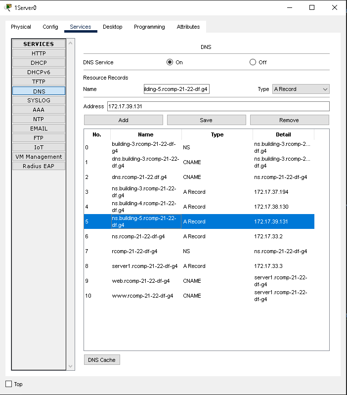
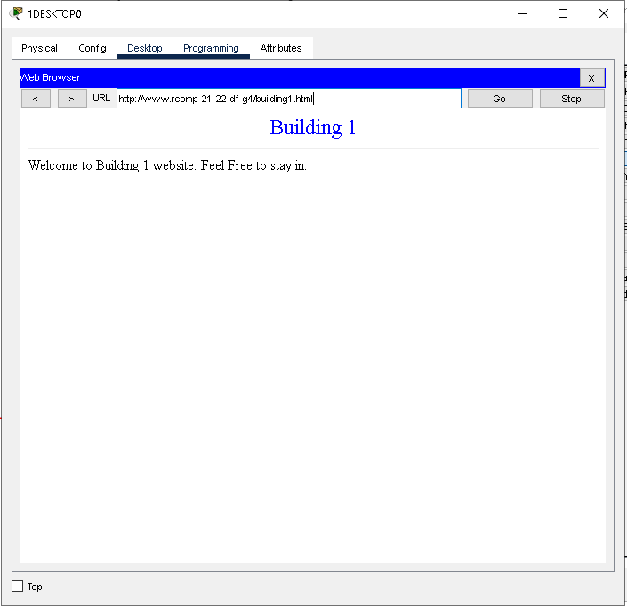
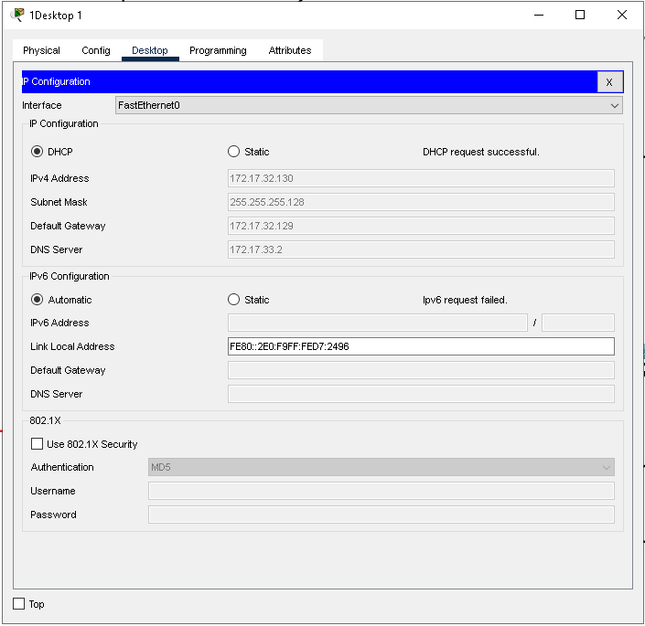
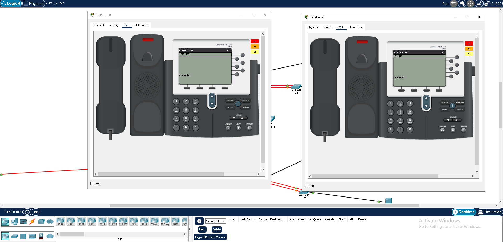

RCOMP 2021-2022 Project - Sprint 3 - Bernardo Silva 1201549
===========================================

# Edifício 1#

## DNS Databases Records ##

---

## IPv4 Networks Relativas ao Edifício 1 e Campus Backbone ##

| VLAN Location | VLAN ID | Network IP    | Default Gateway |
|---------------|---------|---------------|-----------------|
| BackBone      | 280     | 172.17.32.0   | 172.17.32.1     |
| Floor one     | 282     | 172.17.32.128 | 172.17.32.129   |
| DMZ           | 284     | 172.17.33.0   | 172.17.33.1     |
| WIFI          | 283     | 172.17.33.128 | 172.17.33.129   |
| Floor Zero    | 281     | 172.17.34.0   | 172.17.34.1     |
| VoIP          | 285     | 172.17.34.64  | 172.17.34.65    |

## Configurations & Commands

#### OSPF (Open Shortest Path First)
- **Router(config)#** router ospf 1
- **Router(config)#** network 172.17.32.0 0.0.0.127 area 0
- **Router(config)#** network 172.17.32.128 0.0.0.127 area 1

-------------------------------------------------------------------

#### HTTP Server

-------------------------------------------------------------------

#### DHCPv4 Service

* Floor 0:
- **Router(config)#** ip dhcp pool 1Ground  
- **Router(config)#** network 172.17.34.0 255.255.255.192  
- **Router(config)#** default-router 172.17.34.1  
- **Router(config)#** dns-server 172.17.33.2  
- **Router(config)#** domain-name rcomp-21-22-df-g4  
* Floor 1:  
- **Router(config)#** ip dhcp pool 1First  
- **Router(config)#** network 172.17.32.128 255.255.255.128  
- **Router(config)#** default-router 172.17.32.129  
- **Router(config)#** dns-server 172.17.33.2  
- **Router(config)#** domain-name rcomp-21-22-df-g4  
* WiFi:  
- **Router(config)#** ip dhcp pool 1Wifi  
- **Router(config)#** network 172.17.33.128 255.255.255.128  
- **Router(config)#** default-router 172.17.33.129  
- **Router(config)#** dns-server 172.17.33.2  
- **Router(config)#** domain-name rcomp-21-22-df-g4  
* VoIP:
- **Router(config)#** ip dhcp pool 1VoIP
- **Router(config)#** network 172.17.34.64 255.255.255.192  
- **Router(config)#** default-router 172.17.34.65  
- **Router(config)#** option 150 ip 172.17.34.65  
- **Router(config)#** dns-server 172.17.33.2  
- **Router(config)#** domain-name rcomp-21-22-df-g4  

-------------------------------------------------------------------

* Foi garantido que os gateway adresses foram excluidos da pool:  
  ip dhcp excluded-address 172.17.32.129  
  ip dhcp excluded-address 172.17.33.1  
  ip dhcp excluded-address 172.17.33.129  
  ip dhcp excluded-address 172.17.34.1  
  ip dhcp excluded-address 172.17.34.65

-------------------------------------------------------------------

#### VoIP Service

- Os VoIP phones foram adicionados à network e podem comunicar um com o outro.
    - **Router(config)#** telephony-service
    - **Router(config-telephony)#**  max-ephones 20
    - **Router(config-telephony)#**  max-dn 20
    - **Router(config-telephony)#**  ip source-address 172.17.34.65 port 2000
    - **Router(config)#** ephone-dn 11
    - **Router(config-ephone-dn)#**  number 2001
    - **Router(config)#** ephone-dn 12
    - **Router(config-ephone-dn)#**  number 2002

-------------------------------------------------------------------

- A imagem a baixo mostra o telemovel direito a comunicar com o telefone esquerdo.

-------------------------------------------------------------------

#### NAT

- **Router(config)#** ip nat inside source static tcp 172.17.33.2 53 172.17.32.1 53 
- **Router(config)#** ip nat inside source static udp 172.17.33.2 53 172.17.32.1 53 
- **Router(config)#** ip nat inside source static tcp 172.17.33.3 80 172.17.32.1 80 
- **Router(config)#** ip nat inside source static tcp 172.17.33.3 443 172.17.32.1 443 

-------------------------------------------------------------------

#### Firewall

- Firewall Commands:
    - **Router(config)#** permit ip any any 
    - **Router(config)#** ip access-list extended BUILDING1_PCS  
    - **Router(config)#** permit icmp 172.17.32.0 0.0.1.255 any echo    
    - **Router(config)#** permit icmp 172.17.32.0 0.0.1.255 any echo-reply    
    - **Router(config)#** permit ip 172.17.32.0 0.0.0.255 any    
    - **Router(config)#** permit udp any any eq bootps    
    - **Router(config)#** permit tcp 172.17.32.0 0.0.1.255 host 172.17.33.3 eq www   
    - **Router(config)#** permit tcp 172.17.32.0 0.0.1.255 host 172.17.33.3 eq 443  
    - **Router(config)#** permit tcp 172.17.32.0 0.0.1.255 host 172.17.33.2 eq domain   
    - **Router(config)#** permit udp 172.17.32.0 0.0.1.255 host 172.17.33.2 eq domain   
    - **Router(config)#** deny ip any 172.17.32.0 0.0.0.255   
    - **Router(config)#** ip access-list extended INTERNET   
    - **Router(config)#** deny ip 172.17.32.0 0.0.1.255 any   
    - **Router(config)#** permit icmp any 172.17.32.0 0.0.1.255 echo   
    - **Router(config)#** permit icmp any 172.17.32.0 0.0.1.255 echo-reply   
    - **Router(config)#** deny ip any 172.17.32.0 0.0.0.255   
    - **Router(config)#** permit tcp any host 172.17.33.3 eq www   
    - **Router(config)#** permit tcp any host 172.17.33.3 eq 443   
    - **Router(config)#** permit tcp any host 172.17.33.2 eq domain  
    - **Router(config)#** permit udp any host 172.17.33.2 eq domain  
    - **Router(config)#** permit ip any any  
    - **Router(config)#** ip access-list extended BUILDING1_VOIP  
    - **Router(config)#** permit icmp 172.17.32.0 0.0.1.255 any echo  
    - **Router(config)#** permit icmp 172.17.32.0 0.0.1.255 any echo-reply  
    - **Router(config)#** permit ip 172.17.32.0 0.0.0.255 any  
    - **Router(config)#** permit udp any any eq bootps  
    - **Router(config)#** permit udp any any eq tftp  
    - **Router(config)#** permit tcp any host 172.17.34.65 eq 2000  
    - **Router(config)#** permit tcp 172.17.32.0 0.0.1.255 host 172.17.33.3 eq www  
    - **Router(config)#** permit tcp 172.17.32.0 0.0.1.255 host 172.17.33.3 eq 443  
    - **Router(config)#** permit tcp 172.17.32.0 0.0.1.255 host 172.17.33.2 eq domain  
    - **Router(config)#** permit udp 172.17.32.0 0.0.1.255 host 172.17.33.2 eq domain  
    - **Router(config)#** deny ip any 172.17.32.0 0.0.0.255  
-------------------------------------------------------------------

